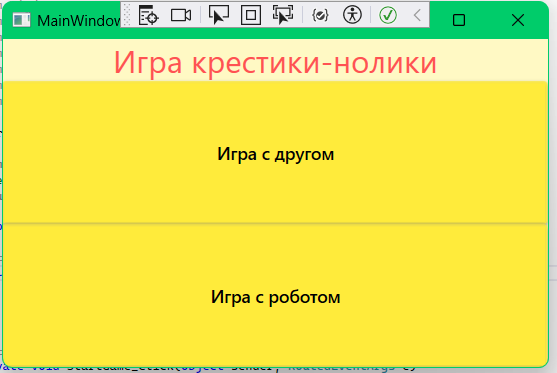
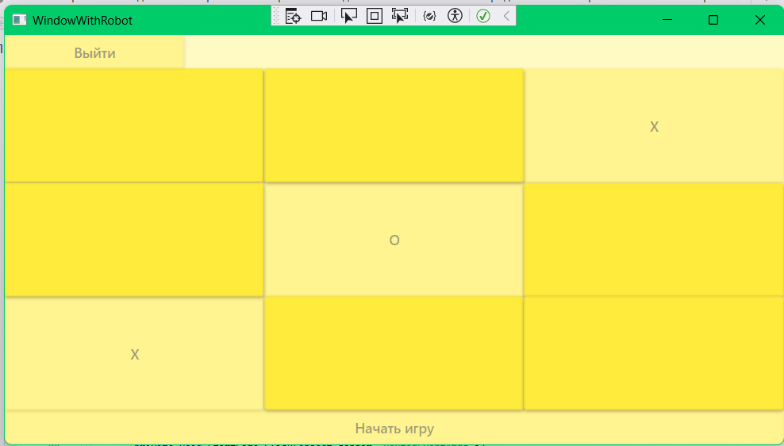

# Tic-tac-toe
__Tic-tac-toe__ - индивидуалный учебный проект. Приложение для игры в крестики-нолики с другом или с роблтом.

## Технологии
* C#
* XAML

## Скриншоты проекта

## Возможности
* Переход из главного меню в игру
* Игра с другом
* Игра с роботом
